---
### Tightly Coupled
In the context of the Spring framework, tight coupling refers to a situation where two or more components are highly dependent on each other. This can make the code difficult to maintain and modify over time. In Spring, dependency injection is used to achieve loose coupling between components, where each component is independent and can be easily replaced or modified without affecting the rest of the system.

---
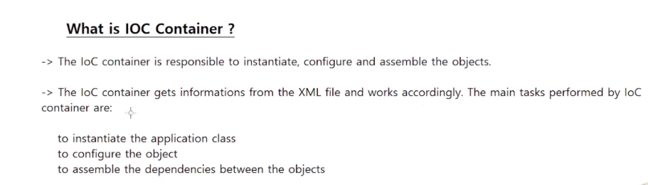
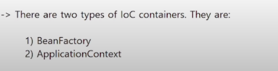

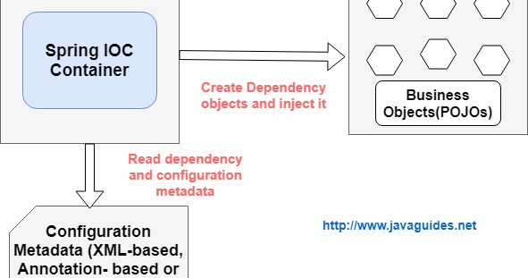

In Spring framework, IOC stands for Inversion of Control. IOC container is a core feature of Spring that manages the lifecycle of Java objects and their dependencies.

An IOC container is responsible for creating objects, wiring them together, configuring them, and managing their complete lifecycle from creation to destruction. The container achieves this by reading the configuration metadata from XML, Java annotations, or Java code.

There are two types of IOC containers in Spring: BeanFactory and ApplicationContext. The ApplicationContext is a more advanced container that provides additional features such as internationalization, event propagation, and integration with other frameworks.

---
 

### Spring Core

The Spring Core dependency provides the basic building blocks of the framework, such as the IoC (Inversion of Control) container and the DI (Dependency Injection) mechanism. It also includes utilities for working with resources, such as files and streams, as well as support for internationalization and exception handling.

### Spring Context 

The Spring Context dependency builds on top of the Spring Core dependency and provides additional functionality for configuring and managing the application context. This includes support for AOP (Aspect-Oriented Programming), event handling, and integration with other frameworks and technologies, such as JPA (Java Persistence API) and JMS (Java Message Service).

---

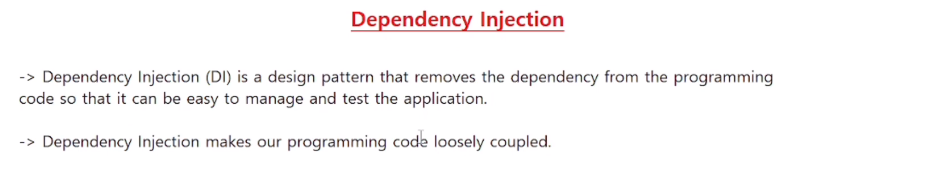

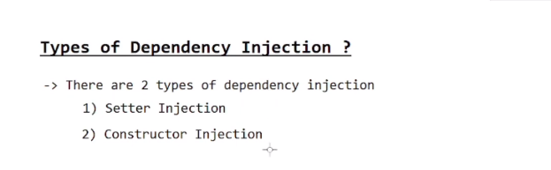

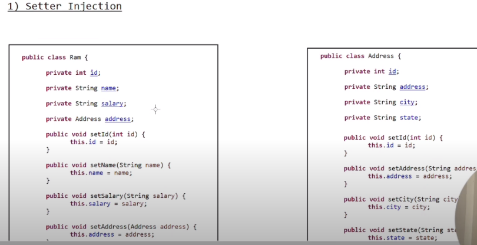

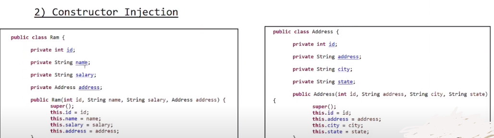

>Constructor Injection:

In this type of DI, dependencies are injected through a class constructor. The IoC container creates an instance of the class and injects the required dependencies into the constructor parameters. This approach ensures that the class is fully initialized before it is used.

>Setter Injection

In this type of DI, dependencies are injected through setter methods. The IoC container creates an instance of the class and calls the setter methods with the required dependencies. This approach allows for more flexibility in changing dependencies at runtime.

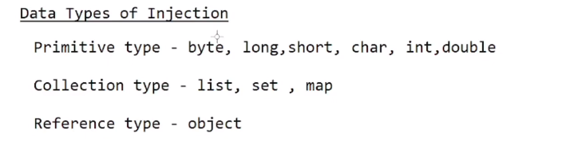

```
 <bean name="st2" class="org.example.primitive.Student">
        <property name="id">
            <value>122</value>
        </property>
        <property name="name">
            <value>Pavy</value>
        </property>
        <property name="address">
            <value>Himachal</value>
        </property>
    </bean>
    
    This is an example of XML configuration for a Spring bean named "st2" of class "org.example.primitive.Student". The bean has three properties: 
    "id", "name", and "address".
    The property tag is used to set the values of the properties. The name attribute specifies the name of the property, and the value 
    tag contains the value to be set.
    In this example, the "id" property is set to 122, the "name" property is set to "Pavy", and the "address" property is set to
    "Himachal". These values will be injected into the corresponding properties of the "org.example.primitive.Student" class when 
    the bean is created by the Spring IoC container.


```
---

```
<property name="name" value="aashu"/>

        <property name="address" >
            <list>
                <value>india</value>
                <value>usa</value>
                <null></null>
            </list>
        </property>
        <property name="phno">
            <set>
                <value>4354664253</value>
                <value>5634756745</value>
            </set>
        </property>
        <property name="courses">
            <map>
                <entry key="java" value="2 monts" />
                <entry key="python" value="3 monts"/>
            </map>
        </property>
        
        This is an XML snippet that defines a bean named "st1" of class "org.example.collection.Student".

The bean has four properties: "name", "address", "phno", and "courses".

The "name" property is a simple string value of "aashu".

The "address" property is a list of three string values: "india", "usa", and null.

The "phno" property is a set of two string values: "4354664253" and "5634756745".

The "courses" property is a map with two key-value pairs: "java" with a value of "2 months" and "python" with a value of "3 months".
```
---

>> **BEAN LIFE CYCLE**

*There are three common ways to implement the Spring bean lifecycle:*

**XML-based configuration**: This approach involves defining the lifecycle methods in the XML configuration file using the init-method and destroy-method attributes in the <bean> element. This approach is simple and easy to understand, but it can be verbose and difficult to maintain for large applications.

**Implementing the InitializingBean and DisposableBean interfaces**: This approach involves implementing the afterPropertiesSet() method from the InitializingBean interface for initialization logic, and implementing the destroy() method from the DisposableBean interface for destruction logic. This approach is more flexible than XML-based configuration, but it requires modifying the bean class, which may not always be feasible.

**Annotation-based configuration**: This approach involves using annotations like @PostConstruct and @PreDestroy to define the initialization and destruction methods respectively. This approach is concise and easy to maintain, but it requires a dependency on Spring's annotation processing.
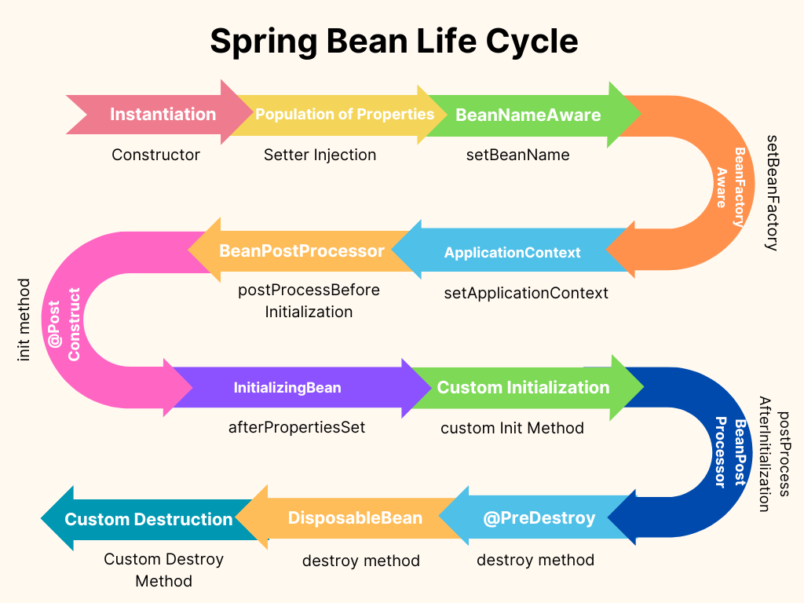
### init()
The init method is used to define the initialization logic for a bean. It is called after the bean has been instantiated and its dependencies have been injected. You can use this method to perform any necessary setup or initialization tasks for your bean.
### destroy()
The destroy method is used to define the destruction logic for a bean. It is called when the container is shutting down or when the bean is being removed from the container. You can use this method to perform any necessary cleanup or finalization tasks for your bean.
### registerShutdownHook()
When you call the  **registerShutdownHook()** method on an instance of **AbstractApplicationContext**, it registers a shutdown hook with the JVM. This shutdown hook ensures that the Spring application context is properly closed and all resources are released when the JVM is shutting down.

By registering a shutdown hook, you ensure that the destroy methods of the beans within the application context are called, allowing them to perform any necessary cleanup or finalization tasks before the application exits.

## Autowiring in spring

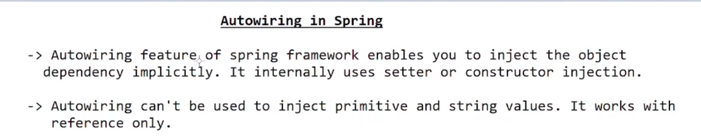

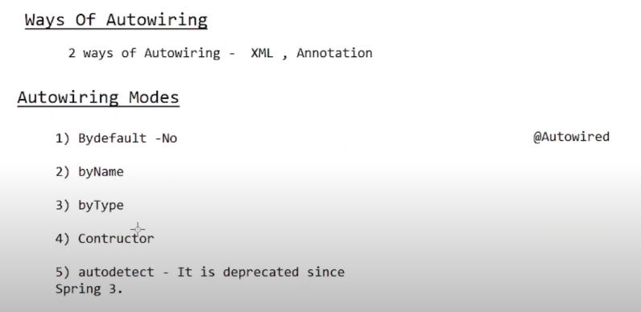
* #### byName
In Spring, autowiring is a feature that allows dependencies to be automatically injected into a bean. When using XML configuration, you can use the "autowire" attribute to specify the type of autowiring you want to use. To autowire by name, you can set the "autowire" attribute to "byName" on the bean definition, like this:
```
<bean id="myBean" class="com.example.MyBean" autowire="byName">
   <!-- properties of MyBean will be autowired by name -->
</bean>
```
With this configuration, Spring will look for beans in the same context with names matching the properties of "MyBean" and automatically inject them.

* #### byType
When autowiring by type, Spring matches the types of beans with the types of properties in a bean. If a property type in a bean is the same as a bean defined in the XML configuration, Spring will automatically inject that bean into the property.

* #### constructor
Spring container looks at the beans on which autowire attribute is set constructor in the XML configuration file. It then tries to match and wire its constructor's argument with exactly one of the beans name in the configuration file. If matches are found, it will inject those beans.

**NOTE-> ByName and ByType uses setter injection and constrctor injectoion uses constructor**

### In Spring Framework, there are three types of @Autowired annotation:

1) Constructor Injection: This type of autowiring is done through the constructor of a class. The @Autowired annotation is used on the constructor parameter to inject the required dependency.
                       
**NOTE -> no need to use @autowired when we declare constructor in a class**
2) Setter Injection: This type of autowiring is done through a setter method of a class. The @Autowired annotation is used on the setter method to inject the required dependency.

3) Field Injection: This type of autowiring is done through a field of a class. The @Autowired annotation is used on the field to inject the required dependency.
>**@Qualifier**

The @Qualifier annotation is used in Java to differentiate between beans of the same type when multiple instances are present in the application context. It is commonly used in conjunction with dependency injection frameworks like Spring.

By using @Qualifier, you can specify a unique identifier for a bean, allowing you to specify which instance of the bean should be used for autowiring or injection.
 ### primary=true
In Spring XML configuration, the primary=true attribute is used to indicate that a bean should be given preference when multiple beans of the same type are present in the application context

 ### @Component
In Spring, the  annotation is used to mark a Java class as a bean that should be managed by the Spring container. When a class is annotated with @Component, Spring will automatically detect and instantiate the bean at runtime, making it available for autowiring and injection into other beans.

###  @Value
In Spring, the  annotation is used to inject values from properties files, system properties, environment variables or other Spring beans into a Java class.