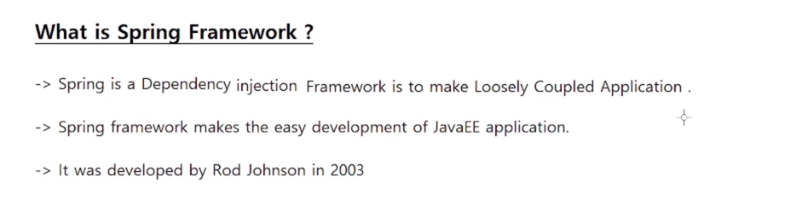

---
### Tightly Coupled
In the context of the Spring framework, tight coupling refers to a situation where two or more components are highly dependent on each other. This can make the code difficult to maintain and modify over time. In Spring, dependency injection is used to achieve loose coupling between components, where each component is independent and can be easily replaced or modified without affecting the rest of the system.

---

---
### Spring Core
The Spring Core dependency provides the basic building blocks of the framework, such as the IoC (Inversion of Control) container and the DI (Dependency Injection) mechanism. It also includes utilities for working with resources, such as files and streams, as well as support for internationalization and exception handling.

### Spring Context 
The Spring Context dependency builds on top of the Spring Core dependency and provides additional functionality for configuring and managing the application context. This includes support for AOP (Aspect-Oriented Programming), event handling, and integration with other frameworks and technologies, such as JPA (Java Persistence API) and JMS (Java Message Service).